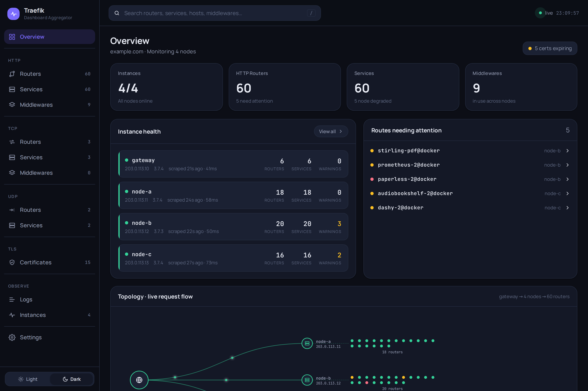
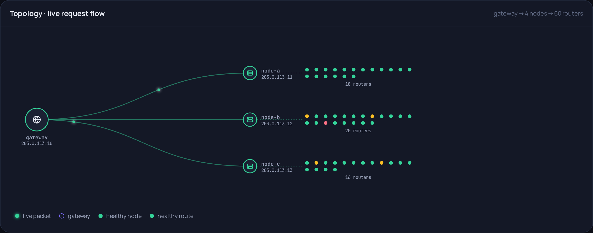
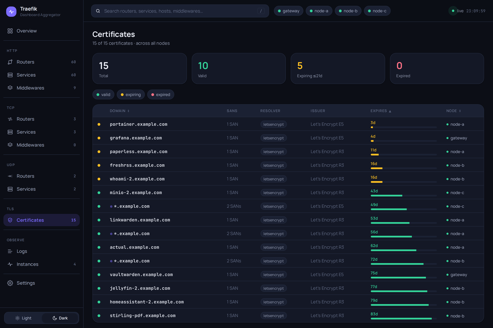
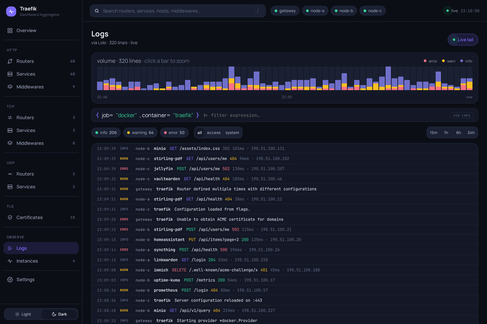
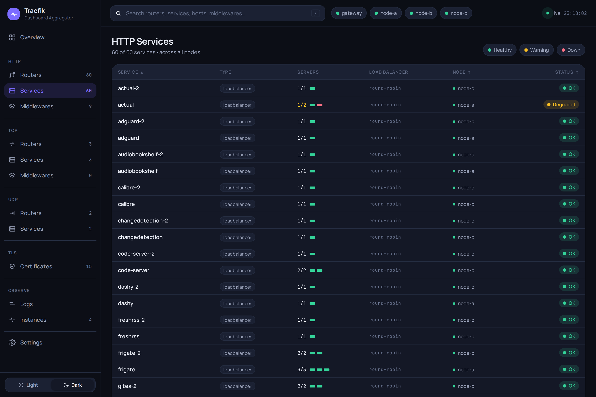
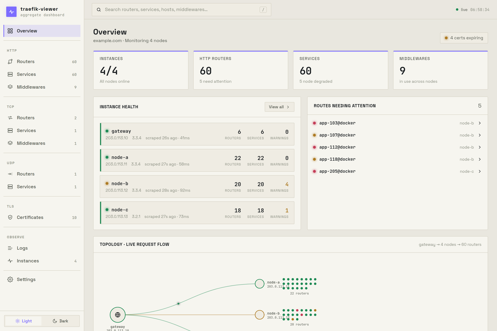

# traefik-viewer

A lightweight, self-hosted **aggregate dashboard** for multiple Traefik instances.

If you run a gateway Traefik that fans out to several downstream Traefik nodes
(e.g. one per Proxmox host, each discovering apps via Docker labels), each node
has its own dashboard but there's no single combined view. `traefik-viewer`
scrapes every node's REST API, merges the results, and serves one live UI of all
routers, services, middlewares, certificates and per-node health.

- **Backend:** Go — polls each instance concurrently, merges into an in-memory
  snapshot, pushes updates over SSE. Single static binary, distroless image.
- **Frontend:** Vite + React + TypeScript SPA, embedded into the binary via
  `go:embed`. Two visual styles (Terminal / Console), light & dark, on a
  Settings page.
- **Logs (optional):** the Traefik API doesn't expose logs, so the Logs view
  queries a **Loki** backend instead.

## Views

Overview (health hero + live topology) · HTTP / TCP / UDP routers, services &
middlewares (sortable, searchable, with a detail drawer) · TLS Certificates
(expiry tracking) · Logs (via Loki) · Instances (per-node health) · Settings.

## Screenshots

> Shown with demo data — in practice the app aggregates live data from your own
> Traefik instances.

**Overview** — per-node health, routes needing attention, and a live
request-flow topology (gateway → nodes → router constellation):



**Topology** — animated request flow from the gateway out to each node and its
router constellation; problem routers light up amber/red:



| Certificates — expiry tracking | Logs — via Loki |
| :---: | :---: |
|  |  |
| **Sortable, searchable tables** | **Terminal style + light theme** |
|  |  |

## Quick start

1. **Configure.** Copy the example and edit it:
   ```sh
   cp config.example.yaml config.yaml
   ```
   If an instance's `/api` requires auth, put credentials in a gitignored `.env`
   (referenced from the config as `${VAR}`):
   ```sh
   NODE01_API_USER=admin
   NODE01_API_PASS=…
   ```

2. **Set your deployment specifics.** `compose.yaml` pulls the published image
   from GHCR and ships generic labels. Edit it directly: set your real host rule
   in the `Host(`…`)` label, optionally pin an image tag or build locally, and
   uncomment the forward-auth block to require login (see
   [docs/authentik.md](docs/authentik.md)).

3. **Run with Docker:**
   ```sh
   docker compose up -d            # pulls ghcr.io/s3ntin3l8/traefik-dashboard-aggregator:latest
   # or build locally: replace `image:` with `build: .` in compose.yaml, then `docker compose up --build -d`
   ```
   The app has no built-in auth — put it behind your gateway/SSO. The published
   image is multi-arch (amd64/arm64), distroless, with the SPA embedded.

4. **Develop** (live reload + HMR):
   ```sh
   docker compose -f compose-dev.yaml up --build
   # UI on http://localhost:5173 (proxies /api to the Go backend on :8080)
   ```

## Configuration

```yaml
server:
  listenAddr: ":8080"
  pollInterval: 15s        # how often to scrape each instance
  requestTimeout: 10s
  domain: example.com      # optional, shown in the UI

loki:
  url: ${LOKI_URL:-}       # e.g. http://loki:3100 — empty disables the Logs tab
  labelMapping: { job: traefik }

authentik:                 # optional — annotate forward-auth routers with the
  url: ${AUTHENTIK_URL:-}  # authentik application/provider/outpost guarding them
  token: ${AUTHENTIK_TOKEN:-}   # read-only API token (see docs/authentik.md)

instances:
  - name: node-01
    url: https://10.0.0.11              # scrape the node directly by LAN IP
    host: traefik.node-01.example.com    # Host header so the node's /api router matches
    dashboardURL: https://traefik.node-01.example.com/dashboard/   # optional deep link
    insecureSkipVerify: true             # if the node serves a default/self-signed cert on its IP
    # basicAuth:                          # only if /api requires auth
    #   username: ${NODE01_API_USER}
    #   password: ${NODE01_API_PASS}
```

### Reaching the downstream APIs

Each downstream Traefik must have its API enabled (`--api=true`) and an `/api`
router the aggregator can reach. Two patterns:

- **Direct by LAN IP (recommended):** the aggregator dials the node's IP and
  sends the `host` header so the existing `Host(...)` `/api` router matches.
  Protect that router with basic auth and supply the credentials here.
- **Via the gateway (fallback):** point `url` at the gateway and `host` at the
  node's API subdomain. Note that a gateway-side `ipAllowList` sees the
  *gateway's* source IP, so it needs `ipStrategy.depth` + trusted
  `X-Forwarded-For` to be meaningful — treat basic auth as the primary control.

Requires Traefik **v3.7+** for the `/api/certificates` endpoint (Certificates
view). Other views work on any v3.

## Endpoints

- `GET /` — the embedded SPA
- `GET /api/snapshot` — full merged snapshot (JSON)
- `GET /api/events` — SSE stream (snapshot on connect + on every change)
- `GET /api/logs/query` · `GET /api/logs/tail` — Loki proxy (when configured;
  accepts an optional validated `?instance=` filter, never raw LogQL)
- `GET /api/config` — feature flags for the SPA (e.g. `lokiEnabled`, `authentikEnabled`)
- `GET /api/me` — identity reflected from an upstream forward-auth proxy
  (display only; empty when no proxy is in front — see [docs/authentik.md](docs/authentik.md))
- `GET /healthz` — liveness

## Security

- **No built-in authentication.** Every endpoint (including `/api/snapshot`,
  which exposes each node's LAN IP, hostnames, and certificate metadata) is
  served unauthenticated. **You must put traefik-viewer behind an authenticating
  reverse proxy / SSO** — this is the only access control. Don't expose it
  directly to an untrusted network. For a step-by-step setup with **authentik**
  (forward auth + OIDC, with a "signed in as …" display and logout link in the
  UI), see **[docs/authentik.md](docs/authentik.md)**.
- **Loki proxy is scoped.** The Logs view never sends raw LogQL. The stream
  selector is built server-side from `loki.labelMapping`; the client may only
  narrow it to a single, allowlist-validated instance name. So a viewer cannot
  read arbitrary Loki streams via the server's Loki credentials. Time windows
  (≤ 7 days) and result counts (≤ 5000) are clamped.
- **Credentialed clients refuse cross-host redirects.** The Loki and Traefik
  HTTP clients send basic auth; they will not follow a redirect to a different
  host, so credentials can't be replayed to an attacker-chosen destination.
- **Response hardening.** All responses carry `X-Content-Type-Options`,
  `X-Frame-Options: DENY`, `Referrer-Policy`, and a Content-Security-Policy.
- **Secrets** stay out of `config.yaml` via `${VAR}` env references; the runtime
  image is distroless and runs as a non-root user.

## CI/CD

**GitHub Actions** (`.github/workflows/`):
- `ci.yml` — on every push/PR to `main`: Go `gofmt`/`vet`/`build`/`test -race`,
  frontend typecheck + build, and a Docker image build (no push).
- `release.yml` — on `v*` tags only, publishes a multi-arch image to
  `ghcr.io/<owner>/<repo>` tagged `:X.Y.Z`, `:X.Y`, `:latest` (and `:sha-…`).
  Pushes to `main` are build-validated by `ci.yml` but not published, so the
  registry only ever holds released images.

**Git hooks** (versioned in `.githooks/`, shared across clones). Enable once
after cloning:
```sh
bash scripts/setup-hooks.sh    # sets core.hooksPath=.githooks
```
- **pre-commit** (fast, staged-only): blocks secret-ish files (`.env`,
  `config.yaml`, keys), blocks real IPs/hostnames in staged content, runs
  `gofmt` + `go vet` on staged Go.
- **pre-push** (heavier): `go build` + `go test`, and the frontend build.

Bypass a hook in a pinch with `--no-verify`. Hooks degrade gracefully if the Go
toolchain or `npm` isn't present locally — CI enforces the full set regardless.

## Development without Docker

```sh
# backend
go run ./cmd/server -config ./config.yaml -debug
# frontend (separate shell)
cd web && npm install && npm run dev
```

## Branding / app icons

The favicon and PWA icon set are **generated**, not hand-edited. Sources live in
`web/branding/` (`icon.svg` = full-bleed badge for PWA/apple-touch; `favicon.svg`
= small-tuned tab favicon). The outputs in `web/public/` (`favicon.{svg,ico}`,
`apple-touch-icon.png`, `pwa-*.png`) are committed, so CI and Docker never run the
generator.

To change the logo:

```sh
# 1. edit web/branding/icon.svg and/or favicon.svg
# 2. regenerate the committed PNG/ICO outputs
cd web && npm i -D --no-save sharp png-to-ico && node scripts/gen-icons.mjs
# 3. rebuild + commit the regenerated web/public/ assets
```

The PWA manifest (name, colors, icon list) is owned by `vite-plugin-pwa` in
[`web/vite.config.ts`](web/vite.config.ts) — add new icon sizes there, not in a
static manifest. Android maskable icons are full-bleed `#7c6cff` so the launcher
masks them to a gap-free circle.

> **Seeing a new icon after a change:** browsers and especially **installed PWAs
> cache icons aggressively**. On Android the icon is baked into a cached *WebAPK*
> at install time. After deploying new assets (`docker compose pull && docker
> compose up -d`), an already-installed app keeps the old icon until you **fully
> uninstall it, clear the site's data in the browser, and reinstall** — a reload
> or in-place reinstall is not enough.

## License

MIT — see [LICENSE](LICENSE).
